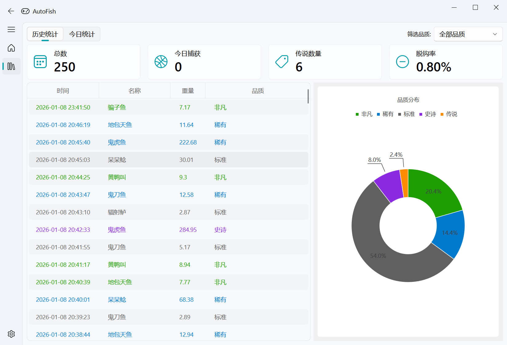
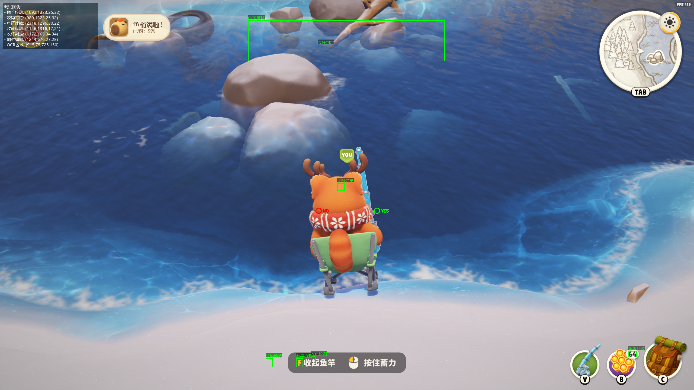

# 🎣 Autofish - 猛兽派对自动钓鱼助手

**🎮 专为《猛兽派对 (Party Animals)》钓鱼玩法设计的自动化辅助工具**

Autofish 是一款基于图像识别的自动钓鱼工具，拥有自动化操作、OCR 钓鱼记录、现代化 GUI 界面等特性，让你在猛兽派对中轻松享受钓鱼乐趣！

---

---

## ✨ 核心功能 (Core Features)

### 🤖 全自动钓鱼流程
Autofish 实现了真正的“一键式”自动钓鱼。启动后，它会自动执行所有必要的操作：
- **自动抛竿**：精准识别抛竿提示，并模拟按键操作。
- **智能等待**：耐心等待鱼儿上钩的信号。
- **循环收线**：在鱼儿上钩后，自动进行收线操作，直至成功捕获。
整个过程完全自动化，无需任何人工干预，让您可以轻松挂机，享受收获的乐趣。

### 🎨 现代化且直观的用户界面
我们深知用户体验的重要性，因此基于 `PySide6` 和 `QFluentWidgets` 为 Autofish 打造了一个现代化、美观且易于使用的图形用户界面。您可以通过这个界面轻松进行所有设置、查看钓鱼记录和统计数据。

### 📊 智能钓鱼记录与统计
Autofish 不仅能自动钓鱼，还能通过 OCR 技术精准识别并记录每一条渔获的详细信息，包括鱼的名称、重量、品质和垂钓时间。所有数据都会被整齐地记录下来，方便您随时回顾和分析。

此外，程序内置了强大的数据统计面板，让您对自己的钓鱼成果一目了然。您可以轻松查看总渔获数量、传说品质鱼类的数量、脱钩率等关键指标，并通过直观的饼图了解不同品质鱼类的分布情况。

### 📸 传奇鱼种自动截图
当您钓到珍贵的“传说”品质鱼类时，Autofish 会自动为您截取当前的游戏画面，并将其保存在 `screenshots` 文件夹中。这个功能可以帮助您轻松记录下每一个激动人心的瞬间，并方便地与朋友分享您的战利品。

### 👁️ 可视化调试模式
对于开发者和高级用户，我们提供了强大的可视化调试功能。开启此模式后，Autofish 会在游戏画面上实时展示其图像识别的过程和结果。

您可以清晰地看到程序正在匹配哪些图像、识别的精确区域以及当前的决策状态。这不仅极大地简化了调试过程，也让您能更直观地了解 Autofish 的工作原理，并根据需要进行调整和优化。

### 🖥️ 迷你悬浮窗
为了让您在享受自动化钓鱼的便利时，仍能随时掌握程序状态，我们设计了简约而不失功能的迷你悬浮窗。

这个悬浮窗会以最不打扰的方式驻留在游戏窗口的边缘，实时显示当前是“工作中”还是“休息中”，以及本次运行的钓鱼次数。您可以随时了解程序动态，而无需切出游戏或打开主界面。

### ⌨️ 全局热键支持
为了提供最便捷的操作体验，Autofish 支持全局热键：
- **F2**：随时启动或暂停自动钓鱼，无需切换窗口。
- **F10**：立即截取当前游戏画面并保存到 `debug_screenshots` 文件夹，方便您在遇到问题时进行排查和反馈。

---

## 🚀 快速开始 (Quick Start)

1.  **下载**：前往 [Releases](https://github.com/R1ckyyyyy/Autofish/releases/latest) 页面，下载最新的 `Autofish_vX.X.X.zip` 压缩包。
2.  **解压**：将压缩包解压到您选择的任意目录。
3.  **运行**：双击 `autofish.exe` 启动程序。

---

## 📖 使用方法 (Usage)

- **启动/暂停**：按下 `F2` 键启动或暂停自动钓鱼。
- **调试截图**：按下 `F10` 键可截取当前游戏画面，用于问题排查和调试。
- **配置**：在程序主界面，您可以根据游戏内的分辨率和设置调整相关参数，以获得最佳识别效果。

---

## 🔧 工作原理 (How it Works)

Autofish 的核心是利用 **OpenCV** 进行图像识别和模板匹配。它会持续分析游戏画面，识别出抛竿提示、咬钩信号和渔获信息等关键图像。当需要记录钓鱼数据时，程序会调用 **RapidOCR** 引擎，对截图中的文字（鱼的名称、重量、品质）进行识别，并将结果保存到本地记录中。

---

## 💾 数据与截图 (Data & Screenshots)

- **钓鱼记录**：所有的钓鱼数据都以 CSV 格式保存在程序目录下的 `data/records.csv` 文件中。您可以使用 Excel 或其他表格软件打开和分析。
- **传奇截图**：钓到“传说”品质鱼类的截图会自动保存在 `screenshots` 文件夹中。
- **调试截图**：通过 `F10` 热键截取的调试图片会保存在 `debug_screenshots` 文件夹中。

---

## 🚀 未来计划 (Future Plans)

- **[ ] 手动钓鱼记录模式**：实现一个独立的记录模块，允许用户在手动钓鱼时，程序也能自动识别并记录渔获信息，满足不同玩家的需求。

---

## ❤️ 致谢与许可 (Credits & License)

本项目的图像识别逻辑和部分资源参考了 [FADEDTUMI/PartyFish](https://github.com/FADEDTUMI/PartyFish) 项目，在此表示诚挚的感谢。

本项目采用 [Apache License 2.0](LICENSE) 许可证。
